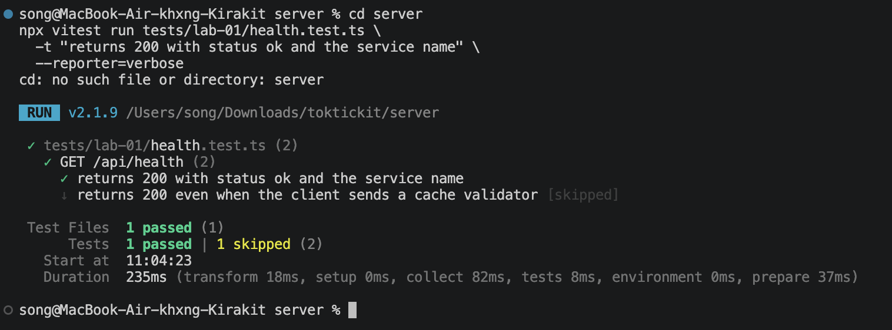
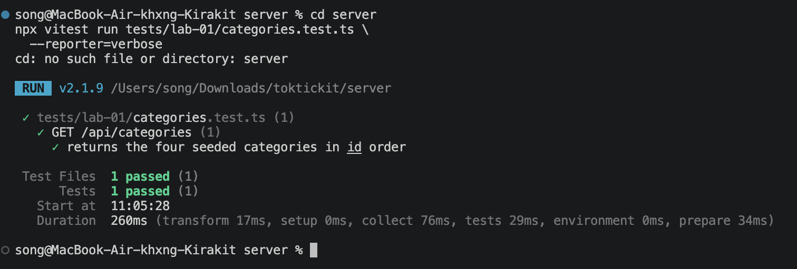
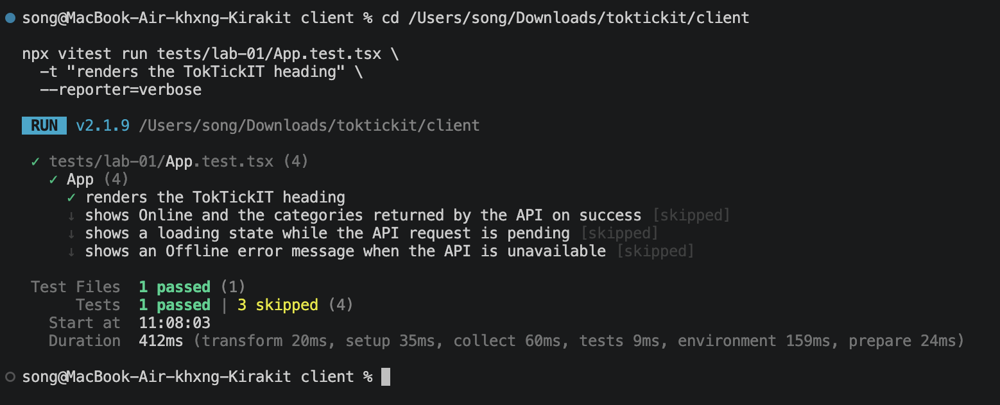
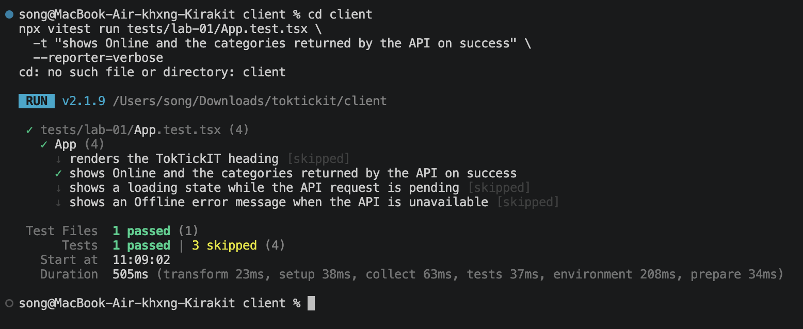
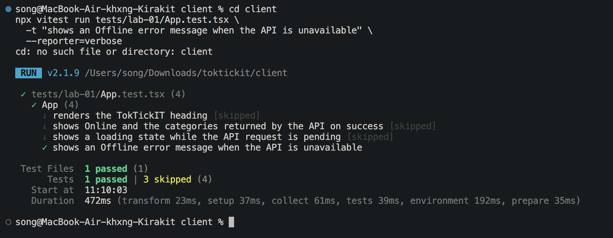

# Lab 1 — Test Plan and Evidence

All test files live under server/tests/lab-01/ and client/tests/lab-01/.

| # | Tool | Test | Result |
|---|------|------|--------|
| 1 | Supertest | GET /api/health returns 200, status=ok | PASS |
| 2 | Supertest | GET /api/categories returns 4 seeded categories in id order | PASS |
| 3 | Vitest | Heading renders | PASS |
| 4 | Vitest | Success state shows Online + category list | PASS |
| 5 | Vitest | Error state shows Offline + message | PASS |

## Passing terminal output / screenshots

### 1. Supertest — health endpoint

Run:

```bash
cd server
npx vitest run tests/lab-01/health.test.ts \
  -t "returns 200 with status ok and the service name" \
  --reporter=verbose
```

The screenshot should show the health test passing with HTTP 200 and
`status=ok`.



*Figure 1. The health endpoint test passed with HTTP 200, `status=ok`, and
the service name. The cache-validator test is skipped because the command
filters this run to the health response test.*

### 2. Supertest — category endpoint

Run:

```bash
cd server
npx vitest run tests/lab-01/categories.test.ts \
  --reporter=verbose
```

The screenshot should show four seeded categories returned in ID order.



*Figure 2. The category endpoint test passed and verified the four seeded
categories in ID order.*

### 3. Vitest — heading

Run:

```bash
cd client
npx vitest run tests/lab-01/App.test.tsx \
  -t "renders the TokTickIT heading" \
  --reporter=verbose
```

The screenshot should show the heading test passing.



*Figure 3. The React heading test passed. The other App tests are skipped
because this run filters to the heading test.*

### 4. Vitest — success state

Run:

```bash
cd client
npx vitest run tests/lab-01/App.test.tsx \
  -t "shows Online and the categories returned by the API on success" \
  --reporter=verbose
```

The screenshot should show the success test passing with `Online` and the
category list returned by the API.



*Figure 4. The React success-state test passed and verified Online plus the
API-returned categories.*

### 5. Vitest — error state

Run:

```bash
cd client
npx vitest run tests/lab-01/App.test.tsx \
  -t "shows an Offline error message when the API is unavailable" \
  --reporter=verbose
```

The screenshot should show the error test passing with `Offline` and the error
message.



*Figure 5. The React error-state test passed and verified the Offline message.*
